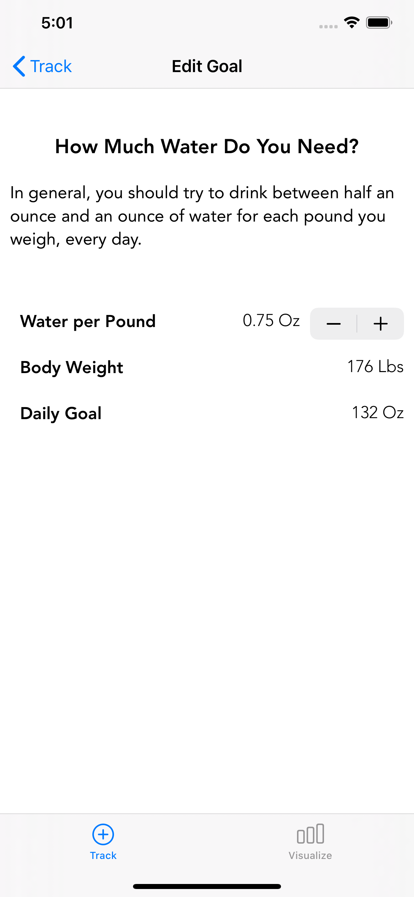

#  WaterTunes

This demo project uses Apple Health Data to set and track goals for daily water consumption.

## Running
Simply build and run on your simulator.  You will need to manually add Weight data within the Health App.

## Architecture
* Uses a HealthManager singleton to abstract and simplify the details of HKHealthKit
* Uses HealthKit for Water and Weight HIPAA secure and sharable storage
* Stores Water/Pound goal in NSUserDefaults
* Uses a drink modal to allow for easy standard water container sizes
* Used static UITableViewControllers to create a reasonably fluid interface in a short amount of time

## Screen Shots
Track           |  Visualize
:-------------------------:|:-------------------------:
  |  

Drink           |  Set Goal
:-------------------------:|:-------------------------:
  |  
